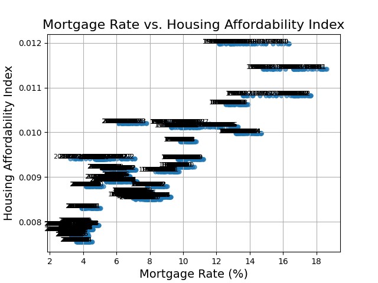

# Economic Indicators and Housing Affordability Analysis

## Project Overview
This project aims to analyze the relationship between various economic indicators, such as mortgage rates, income levels, and housing affordability, over time. By exploring these factors, the project seeks to answer key questions such as whether life has become more expensive.

## Contributors
- [Mason Galusha](https://github.com/MLGalusha)
- [Marquez Ward](https://github.com/mdward911)
- [John Wolfe](https://github.com/j-wolfe5)
- [Stacy Magwano](https://github.com/stacjstaton)

## Data
We primarly used Federal Reserve Econmic Data(FRED) api to gather most of the datasets. For the most part the data was relativly clean which was expected since it was federal data. The main issue was FRED's datasets were very small portions of data, so we had to collect a lot of different data sets as well as use statistics to understand the data better.

- [Proposal](https://docs.google.com/document/d/1A5-LTtKCHrmuNyJga9NzKMxSI5OlEouVu_Cpf4sOPb4/edit)
- [Presentation](https://docs.google.com/presentation/d/1Hqvb2rRlxx34wJOdOkd6x-wsCru26VunCuMzxu0agRI/edit#slide=id.g2f34a2f2839_0_54)

## Key Findings

### 1. Income & Housing
**Income vs. Housing**

- Housing and Income rise at an realatively equal rate showing that they are correlated
- Even though housing and income rise at a similar rate housing prices have gone up signifigantly more(17x more to be exact)!

### 2. Mortgage Rate & Affordability
**Mortgage Rate vs. Housing Affordability**

- There is a positive correlation between Mortgage Rate and Housing Affordabiliy.
- The correlation shows that the lower the mortgage rate the more affordable the housing was.
- It makes sense now but at first that came as a surprise to use just because we thought of affordability correlation more with house price itself than mortgage rate(as mortgage rate dropped house prices went up making us think that affordability has more to do with mortgage rate)

### 3. Trends Found
**Pandemic vs. Economy**

- As we expected before starting this project we noticed spikes during the pandemic.
- This gave us some very interesting insight to what covid was affecting and what it was not affecting(not affecting as much).
- Out of all of our data Mortgage Rates, Gas prices, and housing spiked the most and for the most part up until end of 2023 haven't recovered.

## Conclusions

- Higher mortgage rates lead to lower housing affordability, making homes harder to purchase during periods of high rates.
- Housing prices have risen faster than incomes, making homeownership increasingly difficult for the average person.
- Adjusted for inflation, income growth has been modest, reducing purchasing power and affecting affordability.
- Economic downturns, like the 2008 crisis, and 2020 pandemic impacted housing prices and rates but didn’t improve affordability arguably made it worse.
- The cost of living has outpaced income growth, particularly in urban areas, increasing financial strain on households.
- Housing affordability is influenced by more than just income and mortgage rates, with broader economic conditions playing a significant role.
- Long-term housing affordability has declined, indicating a need for policies that make housing more accessible.

## Future Work

- Investigate much deeper into every aspect of the economy and of the overall United States
- Compare different areas around the United States and find correlations and trends between the economies.
- Explore different datasets like demographics to figure out if any of it affects the economy
- Add time series forecasting to predict whats going to happen in the next couple years(probally need A LOT of data to accuratly predict the economy)
- Explore policies and how much certain policies affect the econonmy.
- How the other countries affect the American Economy

## Thoughts
   Working on this project was both a fun and insightful experience. We dug into economic data and learned a lot about how factors like mortgage rates, income, and inflation influence housing affordability. It was fascinating to see how these elements interact and shape the broader economy.

   Beyond just crunching numbers, we really sharpened our skills in data analysis and statistics. This project pushed us to think critically, interpret data carefully, and present our findings in a way that makes sense to others.

   In the end, we didn’t just answer our initial questions—we also uncovered insights that could guide future research. This project was a great blend of challenge and learning, leaving us with a deeper understanding of both the economy and the power of data.